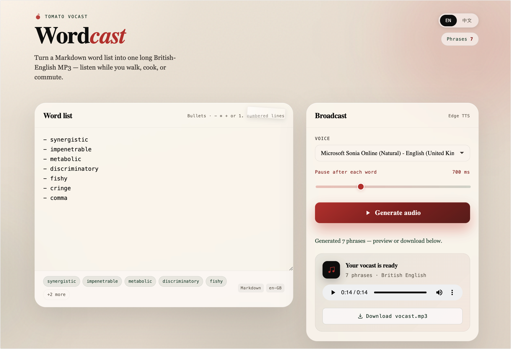

# Tomato Vocast (Wordcast)

**Turn a Markdown vocabulary list into one long British-English MP3** — ideal for passive listening while doing chores, commuting, or walking.

[中文说明](README.zh-CN.md)



## What it does

Tomato Vocast reads bullet or numbered lines from a Markdown file, synthesizes each phrase with [Microsoft Edge TTS](https://github.com/rany2/edge-tts) (British English neural voices), and merges the clips into a single MP3 with configurable pauses between items.

Use it to rehearse spelling words, GRE/SAT vocabulary, phrases from a textbook, or any short list you want to hear on repeat without manually recording each item.

## Features

- **Markdown in, MP3 out** — paste or write a list; get one continuous audio file
- **British English voices** — Sonia, Ryan, and other `en-GB` neural voices via Edge TTS
- **Adjustable gap** — silence after each item (default 700 ms) so you can guess before the next word
- **CLI and web UI** — script for automation, browser UI for quick tries
- **Local only** — runs on your machine; no account or API key required (Edge TTS uses Microsoft’s public endpoint)

## Requirements

- **Python 3.10+**
- **[ffmpeg](https://ffmpeg.org/)** on your `PATH` (needed to merge segments into one MP3)
  - macOS: `brew install ffmpeg`
  - Ubuntu/Debian: `sudo apt install ffmpeg`
  - Windows: install from [ffmpeg.org](https://ffmpeg.org/download.html) and add to PATH

## Installation

```bash
git clone https://github.com/uvoooooo/tomato-vocast.git
cd tomato-vocast

python -m venv .venv
source .venv/bin/activate   # Windows: .venv\Scripts\activate

pip install -r requirements.txt
```

## Markdown format

Only **list lines** are spoken. Headings, blank lines, and HTML comments are skipped.

Supported list styles:

```markdown
# Week 3 — chores listening

- serendipity
- ephemeral
- ubiquitous
- **pragmatic**

1. juxtaposition
2. dichotomy

<!-- This comment is ignored -->
```

- Bullets: `-`, `*`, or `+`
- Numbered: `1.` or `1)`
- Inline Markdown (`**bold**`, `*italic*`, `` `code` ``) is stripped; the plain text is read aloud
- Duplicate lines (case-insensitive) are deduplicated

See [`example-words.md`](example-words.md) for a sample input file.

## Usage

### Web UI (recommended for trying it out)

From the repo root:

```bash
uvicorn server:app --reload --host 127.0.0.1 --port 8765
```

Open [http://127.0.0.1:8765/](http://127.0.0.1:8765/) in your browser. If the port is busy, use another (e.g. `--port 8766`).

1. Edit the vocabulary list in the editor
2. Choose a British English voice and pause length
3. Click **生成长音频** (*Generate long audio*)
4. Play in the browser or download `vocast.mp3`

### Command line

```bash
python wordcast.py example-words.md -o listen.mp3
```

Options:

| Option | Default | Description |
|--------|---------|-------------|
| `-o`, `--output` | *(required)* | Output `.mp3` path |
| `--voice` | `en-GB-SoniaNeural` | Edge TTS voice ID |
| `--pause-ms` | `700` | Milliseconds of silence after each item |

Examples:

```bash
python wordcast.py words.md -o out.mp3 --voice en-GB-RyanNeural --pause-ms 900
```

## How it works

1. **Parse** — extract phrases from Markdown list items
2. **Synthesize** — call Edge TTS once per phrase (small delay between requests)
3. **Merge** — ffmpeg pads each segment with silence and concatenates into one MP3

The web server (`server.py`) exposes:

- `GET /api/voices` — list available British English neural voices
- `POST /api/render` — JSON body `{ "markdown", "voice", "pause_ms" }` → MP3 file

## Project layout

```
tomato-vocast/
├── wordcast.py       # Core logic + CLI
├── server.py         # FastAPI server + static web UI
├── web/index.html    # Browser UI
├── example-words.md  # Sample vocabulary list
└── requirements.txt
```

## Troubleshooting

| Problem | What to do |
|---------|------------|
| `ffmpeg not found on PATH` | Install ffmpeg and ensure it is available in your shell |
| `No list items found` | Use `- item` or `1. item` lines; headings alone are not read |
| Voice list fails to load (web UI) | Check network access to Edge TTS; the UI falls back to `en-GB-SoniaNeural` |
| Port already in use | Start uvicorn with a different `--port` |
